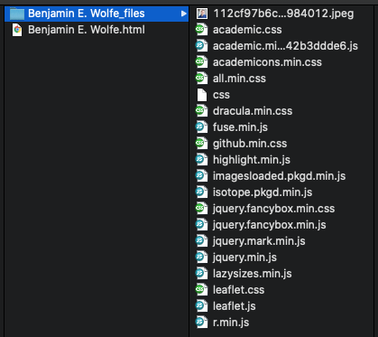
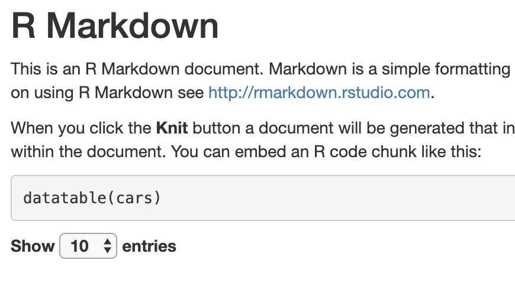
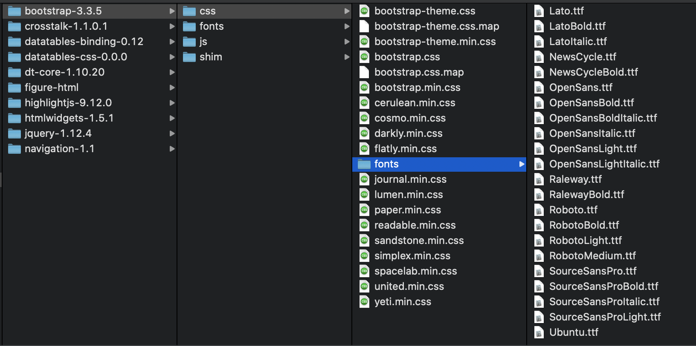
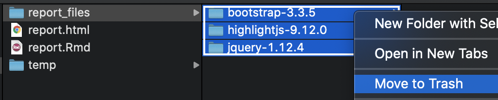

```{r setup, echo=F, message=F}
library(tidyverse)
library(kableExtra)
```

## The Simplicity of Knitr's HTML Output

Have you ever noticed that when you save a page from the internet,
you get an HTML page _plus_ an extra folder of supporting files?

For example, right-click on my website and click "Save As...,"


and this is what you get:



But when you when you render an [R Markdown][4] file as HTML,
instead it comes out as a single HTML file, with no folder of supporting files?

If you haven't noticed this difference, or you don't know what I mean,
we'll walk through a [minimal reproducible example][3] below
to better understand it.

This simplicity makes your output very easy to share with stakeholders.
But it has its drawbacks, and we'll use the same example
later in the post to see those as well.
Then we'll spend time exploring ways around those drawbacks.

Since you might not be at your laptop to actually run this example,
you can also find it in a separate [GitHub repository][5].
You can follow the repository [commit by commit][30]
as we explore `knitr`'s simplicity, the down sides of that simplicity,
and what can be done about those down sides.
To [cut to the chase][28],
you can just look at my [cdnify.R][27] and [pre-commit][29] scripts there.

This upcoming section is covered by the [third][1] and [fourth commits][2].

### Example Setup

In RStudio, from the _New File_ menu at the top left, choose _R Markdown..._.


In the dialog box, feel free to add a title. Then select _HTML_ and hit _OK_.


Save the new file (I called it `Report.Rmd`) and then "knit" it,
either using the _knit_ button at top or by hitting _Control+Shift_K_
(_Command+Shift+K_ on a Mac).


What you'll get is a single file called something like `report.html`.
Open it up to see a beautiful HTML version of the Rmd file you started with.
This file is all you need to send to a stakeholder
for them to open and read your work.


## The Costs of Simplicity: File Size & Transparency

Unfortunately, this simplicity comes with two costs.

### File Size

The first cost is _file size_.
If you look at your report itself, you'll see that it's quite small:
less than 1kB.


But the HTML file is _more than 700kB_.


So what changed?
It's obviously not that HTML is 700x longer than markdown for the same text.

Two things changed:

1. There's now an embedded image (the plot).
1. There are _scripts_ and _styling_ embedded in the file as well
   (JavaScript & CSS content).

We all know that images increase filesize.
But it's actually the scripts and styling
that account for most of the difference:

| original filesize | if we take out the... | the new size is... | so it accounted for... |
| ----------------- | --------------------- | ------------------ | ---------------------- |
| 713kB             | image                 | 630kB              | 83kB                   |
| 713kB             | scripts + styling     | 93kB               | 620kB!                 |

### Transparency

The second cost of putting everything in one easy-to-share HTML file
is _transparency_.

To see this cost, let's peel back the curtain a little on the HTML file.
If you're viewing the report in the RStudio viewer,
go to the top left and click _Open in Browser_:


Then with the report open in your browser of choice,
right-click on the report and click _View Page Source_:


As you browse the page source, just under the title you'll see
what's called _minified code_.


Let's talk through minified code for a moment.

#### Minified JavaScript & CSS

This small web page relies on a number of _JavaScript and CSS libraries_.
One of them, the one depicted here, is a JS library called _jQuery_.

Usually, when code—in any language—relies on a library,
you simply refer to it at the top of the page with one line.
For example, if you have an R script that relies on the `lubridate` package,
you might include a line like this at the top of your script:

```r
library(lubridate)
```

Then throughout your script, R knows what to do
when you use functions from the `lubridate` package.

But for that line to work, whoever's running your code
has to have `lubridate` installed on their computer.
So in the case of our HTML report—which uses jQuery
much like we might use `lubridate`—where would the library be installed?

To simplify all of that, and keep everything in one file,
_literally all of jQuery is included in report.html_.

But libraries are big, of course; [jQuery itself is 250kB][31].
So we often use what's called a [minified][6] version of the library.
White space, new lines, and comments are stripped out,
and variable names are as short as possible.
It's not meant to be readable; it's meant to save filespace.

#### Images

Likewise, images are included _within the text of the HTML document_,
encoded as text.
To see this, scroll down in the source to where you'd expect to see the picture:


The picture is a png file, but it's encoded as a long (83k characters!),
otherwise meaningless string.

## Practical Consequences: Diffing Files

All of this has consequences for your workflow,
perhaps the biggest of which is that you can't diff files.

If you don't use git much for version control,
or you don't follow the terminology,
_diffing files_ just means comparing files (or contrasting them)
to look for _differences_.
Diffing files is good for answering questions like
"What changed since the last time I ran this?"
or "What have I accomplished since my last commit?"
It's what you see when you pull up a git UI to see what's changed.

The problem is that most interfaces won't diff large files automatically,
and some won't diff them at all.
This is what GitHub Desktop shows when I try to diff the HTML we just created:


Of course you can click _Show Diff_.
But even when you _can_ diff the files, all the gobbledeegook—both minified code
and text-encoded images—makes it harder to make sense of the changes.

## Intermission!

In a moment we'll walk through 3 tips to tidy up your HTML output
and reduce your file size while keeping things easy to share.

But before we do that I'd like to make just one change to our report.
(If you're following along in GitHub, see [this commit][7].)
You can skip this section if you like.
All we're doing is making the dataset summary section a little prettier.

### Adding the DT Library

Here's what the dataset summary looks like right now:


It's functional and informative in the aggregate, though a little plain.
But let's say our client wants to be able to browse the actual data,
and let's say they like things to look a little prettier.

For that we use the `DT` library, which takes just 3 lines of code.
First make sure you've installed it:

```r
install.packages("DT")
```

Then add a `library` call to the `setup` code chunk in your report:

````
`r ''````{r setup, include=FALSE}
knitr::opts_chunk$set(echo = TRUE)
library(DT) # add this line
```
````

And finally change the `cars` code chunk from this—

````
`r ''````{r cars}
summary(cars)
```
````

—to this:

````
`r ''````{r cars}
datatable(cars)
```
````

And now the HTML is super pretty!


I include this example to show that with every change
to pretty up your report, add widgets or improve the styling,
you're going to continue adding minified JS or CSS and increasing the filesize.
In this case, we're now up to 916 kilobytes, another increase of 203kB!


And now with that taken care of, we turn to the solution.
As mentioned above we'll walk through 3 steps:

| step (see below)                                                          | solves...    |
| ------------------------------------------------------------------------- | ------------ |
| [code externalization](#externalizing-code)                               | transparency |
| [content delivery networks (CDNs)](#using-content-delivery-networks-cdns) | file size    |
| [file compression (.zip)](#zip-your-files)                                | ease of use  |

## Externalizing Code

As we've seen, your HTML file includes entire libraries of JS & CSS code in it:
code that bloats the file,
code that won't appreciably change from one version to the next,
code that you couldn't read even if you wanted to, because it's minified.

So the first thing to do is to _split that code out
into its own JavaScript and CSS files_.
What's left in the HTML file will then be _actual content_.
It will be small enough to diff and meaningful to diff.
And if the libraries change, you can track that separately.

Let's get to it.

At the end of the _YAML_ at the top of your file
is a line that tells `knitr` how to output results:

```yaml
output: html_document
```

We need to change that so that `knitr` no longer tries to keep everything
in the same document:

```yaml
output:
  html_document:
    self_contained: false
```

When we do, and re-knit, the change is striking.
Suddenly the HTML file is only 7kB (down 99%!):


It's smaller because all the code has been moved to a separate folder,
a folder called `report_files`.
This folder is normal; it's what you get when you save a page off the internet,
as we saw above.

Not only is the HTML file smaller,
but the git diff is now a lot more readable.
In the [diff from this commit][8] in GitHub, for example,
each library file shows up separately,
and you can identify each one by filename
without looking at the contents:


And the HTML file itself is much more readable.
I encourage you to check it out,
either by viewing the source on own HTML file
or [checking my repo][9].

There is one significant downside, though.
While the files are cleaner, smaller, and easier to diff,
we've increased the overall filesize more than 4x.
The new `report_files` folder takes up 4.3 megs!


Where does this size come from?

In our case, 3.7 of those megabytes come from [the Bootstrap library][10],
which bills itself as "the most popular HTML, CSS, and JS library in the world."
Basically, it makes our content look pretty.


Now, filesize may not be an issue for you.
If you host your files on a web server or shared file system,
you might just send links.
Sending links is usually the best way to share content anyway.

But if you have to send attachments,
or if you send links but your shared space has storage restrictions,
you'll want to pare down.

## Using Content Delivery Networks (CDNs)

Putting aside the filesize issue for just a moment,
at this point you might have a question:

> If Boostrap is the most popular
HTML, CSS, and JS library in the world—obviously use by a lot of people—all
these people can't be hosting Bootstrap separately, can they?
There's got to be a way to point to a common location.

If you have that question (as I did), you would be right!
And the way it's done is called a Content Delivery Network, or CDN.

You can see it, for example, on [Bootstrap's site][10]:


Bootstrap is providing URLs for common locations
where they host the library for everyone.
Developers can then point to these URLs at the top of their HTML code,
much like you'd include `library(lubridate)` at the top of an R script.

### Getting Started with CDNs

Currently, your file does something similar, though not quite the same;
it doesn't use CDNs.
It points to Bootstrap and other libraries at the top—


—but the library references are _local_,
pointing to files in the `report_files` folder.
What we want is to replace those references with CDNs.

Once we replace the local references,
we can delete the local files.
And then voilà!
We've reduced the overall filesize.

So to preview the next few sections:

1. First we'll [round up all the libraries we're referencing](#rounding-up-libraries),
   and see which ones have CDNs.
1. Then we'll [swap the references and remove the local files](#removing-local-files).
1. Then we'll [script those steps in R](#have-a-script-do-the-work).
1. Lastly we'll [automate the script](#have-git-run-the-script)
   and forget about it.
   Every time we check in changes, git will run the script automatically.

### Rounding Up Libraries

First we round up the libraries our HTML file uses.
Other HTML files may use different libraries,
but this process should be the same, and is easy.

What are all the libraries we're using?
As we've seen, they're listed near the top of the HTML page:

```html
<script src="report_files/jquery-1.12.4/jquery.min.js"></script>
<link href="report_files/bootstrap-3.3.5/css/bootstrap.min.css" rel="stylesheet" />
<script src="report_files/bootstrap-3.3.5/js/bootstrap.min.js"></script>
<script src="report_files/bootstrap-3.3.5/shim/html5shiv.min.js"></script>
<script src="report_files/bootstrap-3.3.5/shim/respond.min.js"></script>
<script src="report_files/navigation-1.1/tabsets.js"></script>
<link href="report_files/highlightjs-9.12.0/default.css" rel="stylesheet" />
<script src="report_files/highlightjs-9.12.0/highlight.js"></script>
<script src="report_files/htmlwidgets-1.5.1/htmlwidgets.js"></script>
<link href="report_files/datatables-css-0.0.0/datatables-crosstalk.css" rel="stylesheet" />
<script src="report_files/datatables-binding-0.11/datatables.js"></script>
<link href="report_files/dt-core-1.10.19/css/jquery.dataTables.min.css" rel="stylesheet" />
<link href="report_files/dt-core-1.10.19/css/jquery.dataTables.extra.css" rel="stylesheet" />
<script src="report_files/dt-core-1.10.19/js/jquery.dataTables.min.js"></script>
<link href="report_files/crosstalk-1.0.0/css/crosstalk.css" rel="stylesheet" />
<script src="report_files/crosstalk-1.0.0/js/crosstalk.min.js"></script>
```

Let's notice a few patterns here:

* Each line is either a _link_ (for a CSS file)
  or a _script_ (for JavaScript).
* The part we want is in quotes after `href=` (for links)
  or `src=` (for scripts).
* Each reference starts with `report_files/`,
  since that's where the libraries are stored.
* Each library is _versioned_, with numbers like `x.y` or `x.y.z`.
  (This is called [semantic versioning][11]:
  `x` is the major version, `y` the minor version, and `z` the current patch.)

With those patterns in mind, let's write this again:

```{r libraries, echo=F}
libraries <- tribble(
  ~filepath                                       , ~semver  ,
  "jquery-x.y.z/jquery.min.js"                    , "1.12.4" ,
  "bootstrap-x.y.z/css/bootstrap.min.css"         , "3.3.5"  ,
  "bootstrap-x.y.z/js/bootstrap.min.js"           , "3.3.5"  ,
  "bootstrap-x.y.z/shim/html5shiv.min.js"         , "3.3.5"  ,
  "bootstrap-x.y.z/shim/respond.min.js"           , "3.3.5"  ,
  "navigation-x.y/tabsets.js"                     , "1.1"    ,
  "highlightjs-x.y.z/default.css"                 , "9.12.0" ,
  "highlightjs-x.y.z/highlight.js"                , "9.12.0" ,
  "htmlwidgets-x.y.z/htmlwidgets.js"              , "1.5.1"  ,
  "datatables-css-x.y.z/datatables-crosstalk.css" , "0.0.0"  ,
  "datatables-binding-x.y/datatables.js"          , "0.11"   ,
  "dt-core-x.y.z/css/jquery.dataTables.min.css"   , "1.10.19",
  "dt-core-x.y.z/css/jquery.dataTables.extra.css" , "1.10.19",
  "dt-core-x.y.z/js/jquery.dataTables.min.js"     , "1.10.19",
  "crosstalk-x.y.z/css/crosstalk.css"             , "1.0.0"  ,
  "crosstalk-x.y.z/js/crosstalk.min.js"           , "1.0.0"  ,
)

libraries %>% 
  knitr::kable(col.names = c("Simplified Filepath", "Version")) %>% 
  row_spec(c(1:5, 7:8, 12, 14), color = "black", background = "#c2ffca")
```

Now I was able to find CDNs for the 9 _green_ rows,
simply by googling _[name of library] [version] CDN_ for each one.


Here, in order, are the URLs I found.
I tried to match the versioning,
but if it was close I just used what I found.

```{r CDNs, echo=F}
cdns <- tribble(
  ~cdn                                                                                      , ~googled , ~found   ,
  "https://code.jquery.com/jquery-1.12.4.min.js"                                            , "1.12.4" , "1.12.4" ,
  "https://maxcdn.bootstrapcdn.com/bootstrap/3.3.5/css/bootstrap.min.css"                   , "3.3.5"  , "3.3.5"  ,
  "https://maxcdn.bootstrapcdn.com/bootstrap/3.3.5/js/bootstrap.min.js"                     , "3.3.5"  , "3.3.5"  ,
  "https://oss.maxcdn.com/html5shiv/3.7.3/html5shiv.min.js"                                 , "3.3.5"  , "3.7.3"  ,
  "https://oss.maxcdn.com/respond/1.4.2/respond.min.js"                                     , "3.3.5"  , "1.4.2"  ,
  "https://cdn.jsdelivr.net/gh/highlightjs/cdn-release@9.18.0/build/styles/default.min.css" , "9.12.0" , "9.18.0" ,
  "https://cdn.jsdelivr.net/gh/highlightjs/cdn-release@9.18.0/build/highlight.min.js"       , "9.12.0" , "9.18.0" ,
  "https://cdn.datatables.net/1.10.20/css/jquery.dataTables.min.css"                        , "1.10.19", "1.10.20",
  "https://cdn.datatables.net/1.10.20/js/jquery.dataTables.min.js"                          , "1.10.19", "1.10.20",
)
cdns %>% 
  knitr::kable(col.names = c("CDN", "Version Googled", "Version Found"))
```

### Removing Local Files

To be clear, the next step is very straightforward.
We simply replace strings that look like this—

```
report_files/bootstrap-3.3.5/css/bootstrap.min.css
```

—with ones that look like this:

```
https://maxcdn.bootstrapcdn.com/bootstrap/3.3.5/css/bootstrap.min.css
```

Then, since the file `report_files/bootstrap-3.3.5/css/bootstrap.min.css`
is no longer needed (for example), we can delete it.

We'll follow these steps manually once through before scripting them.

#### Manual Steps

Start by opening `report.html` in a text editor:


In the text editor, delete everything from `report_files/` to
`bootstrap.min.css`—


—and for just a moment, try leaving it as a blank string.
This is a great chance to see what Bootstrap actually _does_.

Remember what the report looked like before you deleted that href:



If you save the report right now,
and open it in Chrome, instead it looks like this:


Now that you've seen what you're missing without `bootstrap`,
copy-paste in the URL of the CDN—


—and save and open in Chrome again.
Everything's back to normal!
The CDN worked.


And since the CDN worked, we can delete the file
`report_files/bootstrap-3.3.5/css/bootstrap.min.css`.


You can even refresh the page in Chrome now, and you'll see it still works
without the local file.

So now, since that worked, it's time to take care of the rest of the references!
In cooking-show style, I'll simply pull the completed pie from the oven
and show you what it looks like.

This is the section right under the title in the [HTML file][12].
You can just copy-paste them into your file
if you don't want to go line by line.

```html
<script src="https://code.jquery.com/jquery-1.12.4.min.js"></script>
<meta name="viewport" content="width=device-width, initial-scale=1" />
<link href="https://maxcdn.bootstrapcdn.com/bootstrap/3.3.5/css/bootstrap.min.css" rel="stylesheet" />
<script src="https://maxcdn.bootstrapcdn.com/bootstrap/3.3.5/js/bootstrap.min.js"></script>
<script src="https://oss.maxcdn.com/html5shiv/3.7.3/html5shiv.min.js"></script>
<script src="https://oss.maxcdn.com/respond/1.4.2/respond.min.js"></script>
<script src="report_files/navigation-1.1/tabsets.js"></script>
<link href="https://cdn.jsdelivr.net/gh/highlightjs/cdn-release@9.18.0/build/styles/default.min.css" rel="stylesheet" />
<script src="https://cdn.jsdelivr.net/gh/highlightjs/cdn-release@9.18.0/build/highlight.min.js"></script>
<script src="report_files/htmlwidgets-1.5.1/htmlwidgets.js"></script>
<link href="report_files/datatables-css-0.0.0/datatables-crosstalk.css" rel="stylesheet" />
<script src="report_files/datatables-binding-0.11/datatables.js"></script>
<link href="https://cdn.datatables.net/1.10.20/css/jquery.dataTables.min.css" rel="stylesheet" />
<link href="report_files/dt-core-1.10.19/css/jquery.dataTables.extra.css" rel="stylesheet" />
<script src="https://cdn.datatables.net/1.10.20/js/jquery.dataTables.min.js"></script>
<link href="report_files/crosstalk-1.0.0/css/crosstalk.css" rel="stylesheet" />
<script src="report_files/crosstalk-1.0.0/js/crosstalk.min.js"></script>
```

#### Pruning More Aggressively

Now, in the previous section after we deleted `bootstrap.min.css`,
we only deleted _that one file_.
But Bootstrap includes a lot of files.
Even just the `css` folder has at least 40!



But we don't have to be that surgical.
The local Bootstrap library isn't referred to at all anymore,
so we can delete the whole folder.

In fact, at this point there are just 7 local references left in `report_files`:

* `navigation-1.1/tabsets.js`
* `htmlwidgets-1.5.1/htmlwidgets.js`
* `datatables-css-0.0.0/datatables-crosstalk.css`
* `datatables-binding-0.11/datatables.js`
* `dt-core-1.10.19/css/jquery.dataTables.extra.css`
* `crosstalk-1.0.0/css/crosstalk.css`
* `crosstalk-1.0.0/js/crosstalk.min.js`

Why not just keep those files and delete the rest?

For example, simply consolidate these files to a temp directory,


delete the rest,



and then move the important files back.


One more thing to note!

In these last screenshots, I also held onto the folder `figure-html`;
that's where our plot lives!

Just remember that whatever script we write
will have to solve for `figure-html` as well.

### Pause: What We've Accomplished

Before moving on, let's take a moment to celebrate our successes.
First, if you open your HTML file in Chrome,
you'll see that _everything works_.
We truly no longer needed the local files!

Second, the `report_files` folder is now only _435kB_:
90% smaller than the earlier `report_files` folder,
and less than half the size of the HTML file we started with.


If you don't care to script or automate the process,
feel free to skip down to [Zip Your Files](#zip-your-files) and call it good!

## Have a Script Do the Work

Now comes the time when we ask ourselves:

> This seems pretty straightforward. Do you think we can do it in a script?

And the answer is, of course we can! This is R.
There's got to be a way to do it.

To slow things down, I'm going to write it piece by piece.
If you're impatient and want to skip to the end, go for it!

### Swapping in CDNs

First we'll do some setup work that should be fairly self-explanatory.

For this next section, if you're not familiar with the `here` package,
I recommend [Jenny Bryan][13]'s ode,
"[I love the here package. Here's why.][14]"

Or just set `html_file` to wherever `report.html` lives—e.g.
`/Users/benjamin/report.html`—but
without the `.html` file extension.

```{r first_pass, eval=F}
library(tidyverse)
library(here)

# make a tibble of references to be replaced
references <- tibble(
  local_file = c(
    "jquery-1.12.4/jquery.min.js",
    "bootstrap-3.3.5/css/bootstrap.min.css",
    "bootstrap-3.3.5/js/bootstrap.min.js",
    "bootstrap-3.3.5/shim/html5shiv.min.js",
    "bootstrap-3.3.5/shim/respond.min.js",
    "highlightjs-9.12.0/default.css",
    "highlightjs-9.12.0/highlight.js",
    "dt-core-1.10.19/css/jquery.dataTables.min.css",
    "dt-core-1.10.19/js/jquery.dataTables.min.js"
  ),
  cdn_url = c(
    "https://code.jquery.com/jquery-1.12.4.min.js",
    "https://maxcdn.bootstrapcdn.com/bootstrap/3.3.5/css/bootstrap.min.css",
    "https://maxcdn.bootstrapcdn.com/bootstrap/3.3.5/js/bootstrap.min.js",
    "https://oss.maxcdn.com/html5shiv/3.7.3/html5shiv.min.js",
    "https://oss.maxcdn.com/respond/1.4.2/respond.min.js",
    "https://cdn.jsdelivr.net/gh/highlightjs/cdn-release@9.18.0/build/styles/default.min.css",
    "https://cdn.jsdelivr.net/gh/highlightjs/cdn-release@9.18.0/build/highlight.min.js",
    "https://cdn.datatables.net/1.10.20/css/jquery.dataTables.min.css",
    "https://cdn.datatables.net/1.10.20/js/jquery.dataTables.min.js"
  )
)

# set the filepath information
html_file <- here("report")              # filepath without the extension
fullpath  <- paste0(html_file, ".html")  # actual name of HTML file
dir_path  <- paste0(html_file, "_files") # directory of local libraries

# also just the name of the directory will come in handy
dependency_dir <- "report_files"

# grab the page contents
page_contents <- read_lines(fullpath)
```

Now let's make the replacements.
Here [purrr::reduce2][15] is the workhorse;
you'll see a deeper explanation below.

```{r replacements, eval=F}
# the actual strings we're replacing always start with report_files/
references <-
  mutate(
    references,
    local_file = paste(dependency_dir, local_file, sep = "/")
  )

page_contents <- 
  reduce2(
    .x = references$local_file,
    .y = references$cdn_url,
    .f = str_replace,
    .init = page_contents
  )

write_lines(page_contents, fullpath)
```

[purrr::reduce2][15] runs through our replacements iteratively,
as if we'd written it like this:

```{r replace2, eval=F}
page_contents <-
  page_contents %>% 
  str_replace(references$local_file[1], references$cdn_url[1]) %>% 
  str_replace(references$local_file[2], references$cdn_url[2]) %>% 
  str_replace(references$local_file[3], references$cdn_url[3]) %>% 
  str_replace(references$local_file[4], references$cdn_url[4]) %>% 
```

...and so on down the line.

And we use `write_lines` from the `readr` package (loaded with the `tidyverse`)
to write the contents back to the HTML file.

### Listing Files to Delete

Now that we've swapped local references for CDNs,
we can go about deleting files.

[As described above](#removing-local-files),
we'll do that by first deciding which files to _keep_,
and then deleting the rest.

To decide which files to keep,
we'll loop through the contents of the file
and capture any remaining references with the [regular expression][32]
`report_files/([^\"]+)`:

* the string `report_files/`,
* followed by [anything but quotes][34] `[^\"]`,
* [one or more times][35] `+`.
* We use a [capture group][33] `()` to get just the part after `report_files/`.

```{r get_remaining, eval=F}
get_remaining <- function(page_contents) {
  pattern <- paste0(dependency_dir, "/([^\"]+)")          # pattern to watch for
  remaining_lines <- str_which(page_contents, pattern)    # what lines have it?
  if (!length(remaining_lines)) return(NA_character_)     # none? return NA.
  
  str_match(page_contents[remaining_lines], pattern)[, 2] # return matches
}
```

For more on regular expressions
see the [stringr documentation][16], especially the page on [str_match][17].
Or see https://www.regular-expressions.info/ for a full tutorial.

### Deleting Files

To actually delete the files
we'll use the [fs package][18].
It has intuitively named, vectorized functions like

* [path][19] to construct filepaths,
* [dir_ls][20] to list the files in a directory, and
* [file_delete][21] to delete files.

```{r delete_files, eval=F}
library(fs)

# keep the files still explicitly named in the HTML
keep_these <- 
  path(dir_path, get_remaining(page_contents))

# remove everything else in the report_files folder
remove_these <- 
  setdiff(
    dir_ls(dir_path, recurse = TRUE, type = "file"),
    keep_these
  )

file_delete(remove_these)
```

### Looping through Multiple Reports

Now let's say we have more than one HTML file—not just `report.html`.
Let's say they're all in one directory, including subfolders.
Can we handle them all at once?

Sure we can!
We wrap the code above in a function,
and run that function for all the reports.

Let's call the function `cdnify`:

```{r cdnify, eval=F}
library(tidyverse)
library(here)
library(fs)

# make a tibble of references to be replaced
references <- tibble(
  local_file = c(
    "jquery-1.12.4/jquery.min.js",
    "bootstrap-3.3.5/css/bootstrap.min.css",
    "bootstrap-3.3.5/js/bootstrap.min.js",
    "bootstrap-3.3.5/shim/html5shiv.min.js",
    "bootstrap-3.3.5/shim/respond.min.js",
    "highlightjs-9.12.0/default.css",
    "highlightjs-9.12.0/highlight.js",
    "dt-core-1.10.19/css/jquery.dataTables.min.css",
    "dt-core-1.10.19/js/jquery.dataTables.min.js"
  ),
  cdn_url = c(
    "https://code.jquery.com/jquery-1.12.4.min.js",
    "https://maxcdn.bootstrapcdn.com/bootstrap/3.3.5/css/bootstrap.min.css",
    "https://maxcdn.bootstrapcdn.com/bootstrap/3.3.5/js/bootstrap.min.js",
    "https://oss.maxcdn.com/html5shiv/3.7.3/html5shiv.min.js",
    "https://oss.maxcdn.com/respond/1.4.2/respond.min.js",
    "https://cdn.jsdelivr.net/gh/highlightjs/cdn-release@9.18.0/build/styles/default.min.css",
    "https://cdn.jsdelivr.net/gh/highlightjs/cdn-release@9.18.0/build/highlight.min.js",
    "https://cdn.datatables.net/1.10.20/css/jquery.dataTables.min.css",
    "https://cdn.datatables.net/1.10.20/js/jquery.dataTables.min.js"
  )
)

cdnify <- function(html_file) {
  # set the filepath information
  fullpath <- paste0(html_file, ".html")  # actual name of HTML file
  dir_path <- paste0(html_file, "_files") # directory of local libraries
  
  # also just the name of the directory will come in handy
  dependency_dir <- path_file(dir_path)
  
  # grab the page contents
  page_contents <- read_lines(fullpath)
  
  # the actual strings we're replacing always start with report_files/
  references <-
    mutate(
      references,
      local_file = paste(dependency_dir, local_file, sep = "/")
    )
  
  page_contents <- 
    reduce2(
      .x = references$local_file,
      .y = references$cdn_url,
      .f = str_replace,
      .init = page_contents
    )
  
  write_lines(page_contents, fullpath)
  
  get_remaining <- function(page_contents) {
    pattern <- paste0(dependency_dir, "/([^\"]+)")          # pattern to watch for
    remaining_lines <- str_which(page_contents, pattern)    # what lines have it?
    if (!length(remaining_lines)) return(NA_character_)     # none? return NA.
    
    str_match(page_contents[remaining_lines], pattern)[, 2] # return matches
  }
  
  # keep the files still explicitly named in the HTML
  keep_these <- 
    path(dir_path, get_remaining(page_contents))
  
  # remove everything else in the report_files folder
  remove_these <- 
    setdiff(
      dir_ls(dir_path, recurse = TRUE, type = "file"),
      keep_these
    )
  
  file_delete(remove_these)
}
```

Now [purrr::walk][22] will do the heavy lifting,
applying `cdnify` to the relevant files.

```{r walk, eval=F}
current_dir <- here() # or whatever directory

# list all the HTML files anywhere in current_dir (but w/o the html extension)
pages <- 
  current_dir %>% 
  dir_ls(recurse = T, regexp = "\\.html") %>% 
  str_replace("\\.html$", "")

# HTML files are only relevant if they come from an R Markdown file,
# and if they have a folder of local dependencies
are_from_markdown <- file_exists(paste0(pages, ".Rmd"))
have_dependencies <- dir_exists(paste0(pages, "_files"))

walk(
  pages[are_from_markdown & have_dependencies],
  cdnify
)
```

## Have Git Run the Script

We've now scripted the whole process.
The very _best_ solution, though,
would include automating the script so we never had to think about it again.
If all our reports were in a git repository, for example—if that
were the folder our script used—then maybe
git could run the script with each commit.

And that's exactly what we can do using a feature called [git hooks][23].
_Git hooks_ are bash scripts that run when you do things in git;
you can write hooks that run automatically before a commit,
before you rebase, or before you push changes, for example.
In this case, we can tell the bash script where to find our R script,
and where to find the R interpreter.
Then once we've set it in motion, we never have to think about our script again!

_(Aside: It's possible you're not using git at all.
Many R users, data scientists, and coders in general highly recommend it!
If you're starting from the ground up,
you can take advantage of some great resources,
like Jenny Bryan and Jim Hester's [Happy Git and GitHub for the useR][24].
If you feel reasonably comfortable with git, read on!)_

To make our git hook, you first need to make sure you're seeing hidden files.
On a Mac you can do that by pressing Command-Shift-Period in Finder.
Then in the folder you're in,
go to `.git` → `hooks` → `pre-commit.sample`.
Make a copy of `pre-commit.sample`, and delete the `.sample` part.


Here you see concretely all the git events that you can "hook" with a git hook.
`pre-commit` is only one option.
But it's important we run the script to remove local files "pre-commit,"
because otherwise those libraries will live on in your commit history,
bloating the repository forever.

### Writing a Bash Script

Now I don't actually know bash well, but that's what Google is for:

```bash
#!/bin/sh
# check these variables (using forward slashes instead of backslashes):
R_SCRIPT="/usr/local/bin/Rscript" # the location of Rscript on your computer
CDN_SCRIPT="cdnify.R"             # the location of the R script in the repo

# find the local REPO directory
HOOKS_DIR="$( cd "$( dirname "${BASH_SOURCE[0]}" )" && pwd )"
GIT_DIR="$(dirname "$HOOKS_DIR")"
REPO="$(dirname "$GIT_DIR")"

# switch to CDNs
"$R_SCRIPT" "$REPO/$CDN_SCRIPT" "$REPO"

# stage updated files
git add -u

exit 0
```

Let's walk through a few parts of that script:

* `HOOKS_DIR` is the location of `your_repository/.git/hooks`,
   where the `pre-commit` script lives.
* `GIT_DIR` is the location of `your_repository/.git`.
* `REPO` is the location of your repository.

So this line—

```bash
"$R_SCRIPT" "$REPO/$CDN_SCRIPT" "$REPO"
```

—translates to something like this:

```bash
"/usr/local/bin/Rscript" "/Users/benjamin/Documents/GitHub/knitr-cdn-demo/cdnify.R" "/Users/benjamin/Documents/GitHub/knitr-cdn-demo"
```

It's saying to run the R interpreter
on your cdnify.R script,
and pass the path of the repo to that script.
I'll add that for many people,
`/usr/local/bin` is on something called your PATH,
and you can get away with skipping it:

```bash
R_SCRIPT="Rscript"
```

Now, unfortunately this script will do exactly what we tell it to do,
not what we want it to do.
So if we leave it there,
it will make the appropriate changes and follow through with your commit...
_without staging the new changes!_

This is why we add `git add -u` at the end, to ensure the changes stick.
But beware that this line also has an important side effect:
__Any changes to your repo will be staged and committed,
even if you hadn't staged them yourself.__

There could be a way to do this differently—maybe have R
return a list of files to stage,
to be more surgical about it—but that lies
beyond my current bash scripting abilities.

### Tweaking the R Script

We just said that this line—

```bash
"/usr/local/bin/Rscript" "/Users/benjamin/Documents/GitHub/knitr-cdn-demo/cdnify.R" "/Users/benjamin/Documents/GitHub/knitr-cdn-demo"
```

—passes the location of the repository to the R script.
We also need to tell the script what to do with it.

To pull command-line arguments into an R script,
we use the [commandArgs][25] function.
`commandArgs()` returns a vector of the arguments you passed to the script.
`commandArgs()[1]` will return just the first argument;
`as.character(commandArgs()[1])` ensures it's passed in as a character string.

So we could replace this line near the bottom of our script—

```r
current_dir <- here()
```

—with this one—

```r
current_dir <- as.character(commandArgs(trailingOnly = T)[1])
```

—and our script would always automatically run on the git repository.

But sometimes we'll still want to run the script on its own, right?
To have the code automatically differentiate between contexts (git or manual),
we can use the [interactive][26] function:

```r
current_dir <- 
  if (interactive()) {
    here()
  } else {
    as.character(commandArgs(trailingOnly = T)[1])
  }
```

### Troubleshooting

Before git is able to run the githook,
sometimes your OS needs to know that it's _executable_.
If that happens you might get something like the yellow error message here:


The answer is to run this simple line from the command line:

```bash
chmod +x .git/hooks/pre-commit
```

`chmod` is an abbreviation of "change mode,"
and the `+x` means "make it executable."
It's not rocket science, just (again) good Googling.

Then your file should be clearly different from the sample githook files
(though the exact way that's shown will vary from OS to OS):


### Logging

Lastly, we want to make sure that troubleshooting is easier in the future.
One way to do that is to add logging, or at least messaging.
For the full version of the script with thorough logging,
please see [cdnify.R on GitHub][27].

This is what your terminal output looks like when you run it,
even when you haven't re-knit any HTML files, so there's nothing to remove:


Here's a quick preview of the changes you'll see in the enhanced script:

* I don't load the whole tidyverse, only the specific packages I use.
* I start with a whole elaborate function to provide messaging around packages.
  Much of this is about troubleshooting,
  so I'm sure to message which if any packages failed as well.
  If a package fails to load I actually attempt to install it from CRAN,
  and then try to load it again.
* I spend time capturing which version of each library was found in the file,
  again for troubleshooting.
  If `knitr` suddenly upgrades its default versions of Bootstrap or jQuery,
  I just want to be able to notice that.
  The code is also more flexible, so that the newer version would get picked up.
* Timestamps and actions are explicitly spelled out.
  If anything _is_ changed, you'll see exactly what,
  including which version was removed and what URL was used to replace it.

## Zip Your Files

In the end, this method does leave you with a _folder_ of files to share,
rather than a simple HTML file.
You can still send them easily by zipping both the report and the report files
into a single zip folder.


In this case, the final zipped size was a meager 80 kilobytes:
less than a tenth the size of the original uncompressed HTML file.


You may still work in a context
where your stakeholders either can't or won't open a zip file
and click through on the single HTML file inside it.
Unfortunately, I don't have a solution for that problem.

But what we have solved can still be quite useful:
Your report now takes a tenth of the size it once did,
and perhaps more importantly you're able to diff your output files
and easily understand what's changed.

[1]: https://github.com/BenjaminWolfe/knitr-cdn-demo/commit/a553b780b1bfd37daa1b05e6ec48e022d7850d4f
[2]: https://github.com/BenjaminWolfe/knitr-cdn-demo/commit/7b79bc5bd333e12e5146953b646aff364f827eef
[3]: https://reprex.tidyverse.org/articles/reprex-dos-and-donts.html
[4]: https://rmarkdown.rstudio.com/
[5]: https://github.com/BenjaminWolfe/knitr-cdn-demo
[6]: https://en.wikipedia.org/wiki/Minification_(programming)
[7]: https://github.com/BenjaminWolfe/knitr-cdn-demo/commit/fb3c31288afce993a5599f09a55fd0223a77ec97
[8]: https://github.com/BenjaminWolfe/knitr-cdn-demo/commit/a0e6044e03ad78a171448de58ba96eaa8f8ed22f
[9]: https://github.com/BenjaminWolfe/knitr-cdn-demo/blob/a0e6044e03ad78a171448de58ba96eaa8f8ed22f/report.html
[10]: https://getbootstrap.com/
[11]: https://semver.org/
[12]: https://github.com/BenjaminWolfe/knitr-cdn-demo/blob/740b1de33fdd6f2ef09b21661afe022789c865af/report.html
[13]: https://twitter.com/JennyBryan
[14]: https://github.com/jennybc/here_here
[15]: https://purrr.tidyverse.org/reference/reduce.html
[16]: https://stringr.tidyverse.org/articles/regular-expressions.html
[17]: https://stringr.tidyverse.org/reference/str_match.html
[18]: https://fs.r-lib.org/
[19]: https://fs.r-lib.org/reference/path.html
[20]: https://fs.r-lib.org/reference/dir_ls.html
[21]: https://fs.r-lib.org/reference/delete.html
[22]: https://purrr.tidyverse.org/reference/map.html
[23]: https://git-scm.com/book/en/v2/Customizing-Git-Git-Hooks
[24]: https://happygitwithr.com/
[25]: https://www.r-bloggers.com/passing-arguments-to-an-r-script-from-command-lines/
[26]: https://stat.ethz.ch/R-manual/R-devel/library/base/html/interactive.html
[27]: https://github.com/BenjaminWolfe/knitr-cdn-demo/blob/master/cdnify.R
[28]: https://en.wikipedia.org/wiki/Cut_to_the_chase
[29]: https://github.com/BenjaminWolfe/knitr-cdn-demo/blob/master/pre-commit
[30]: https://github.com/BenjaminWolfe/knitr-cdn-demo/commits/master
[31]: https://mathiasbynens.be/demo/jquery-size
[32]: https://www.regular-expressions.info/
[33]: https://www.regular-expressions.info/brackets.html
[34]: https://www.regular-expressions.info/charclass.html
[35]: https://www.regular-expressions.info/repeat.html
